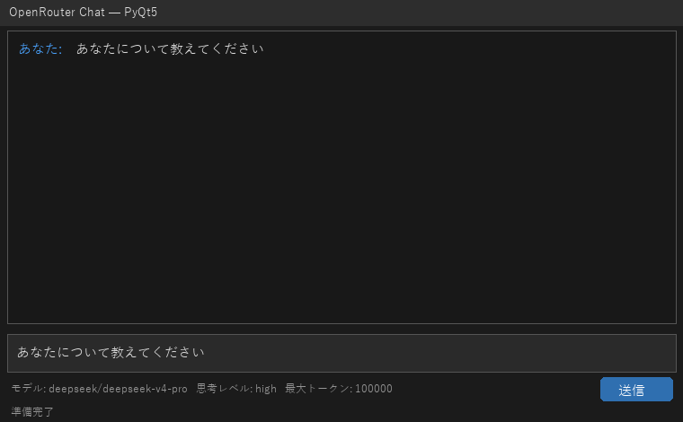
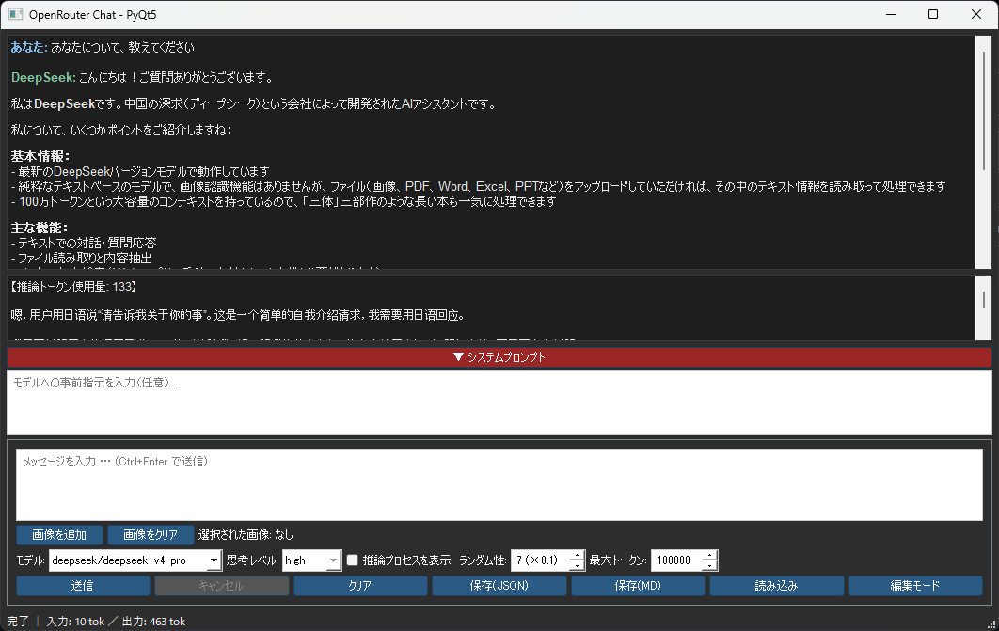

# OpenRouter Chat Client (PyQt5)





## 概要

OpenRouter API を利用した、デスクトップ向けチャットクライアントアプリです。
PyQt5 を用いて GUI を構築し、複数の LLM モデル（DeepSeek / Grok / Gemini）を切り替えて利用できます。

個人学習および技術検証を目的として開発しました。長文の執筆用途を想定しています。

---

## 使用技術

- 言語：Python 3.10 以上（型注記に `X | Y` 記法を使用）
- GUI：PyQt5
- HTTP通信：requests（ストリーミング対応）
- Markdownレンダリング：markdown（オプション）
- 外部API：OpenRouter API
- データ保存形式：JSON / Markdown
- テスト：pytest

---

## 主な機能

### チャット・表示
- チャット形式での LLM との対話（ストリーミング表示）
- Markdown レンダリング（コードブロック・テーブル対応、`markdown` ライブラリ必須）
- モデル出力の HTML サニタイズ（外部リソースを読みに行く要素を除去）
- 推論プロセス・推論トークン数の表示（対応モデルのみ）
- 発言ごとに応答したモデルを記録し、その名前と色で表示
- Ctrl+ホイールでフォントサイズ変更
- 右クリックメニューによるテキストコピー（選択範囲 / 全文）

### モデル・推論設定
- モデル一覧を OpenRouter から自動取得（24時間キャッシュ、取得失敗時は内蔵定義で動作）
- モデルごとの能力に応じた UI の切り替え
  - 最大トークン数の上限をモデルの出力上限に自動設定
  - 画像を受け付けないモデルでは添付を無効化
  - 推論・思考レベルの対応可否を自動判定
- 思考レベル選択（minimal / low / medium / high / xhigh）
- ランダム性（temperature）・最大トークン数の設定
- 設定の自動保存（QSettings）

### 使用量・コスト
- トークン使用量の表示（入力 / 出力）
- 応答ごとのコストとセッション累計の表示
- 会話履歴のトークン量、コンテキスト長に対する割合、次回リクエストの概算コストを常時表示

### 入力・操作
- Ctrl+Enter でメッセージ送信
- 画像の添付送信（ファイル選択 / クリップボード貼り付け / ドラッグ&ドロップ）
- テキストファイルのドラッグ&ドロップ（ファイル名付きで本文に挿入）
- システムプロンプト入力（折りたたみ式）とプリセット管理
- 直前の応答を破棄して応答し直す「再生成」
- 会話の直接編集モード
- リクエストのキャンセル（応答が途切れていても即座に停止）
- APIエラー時の再試行ダイアログ
- Ctrl+F でインライン検索（前後ナビゲーション対応）

### 保存・読み込み
- 会話履歴の保存 / 読み込み（JSON、推論内容と使用量も保持）
- Ctrl+S で確認なしの上書き保存
- タイトルバーに保存先と未保存マークを表示
- Markdown ファイルとしてエクスポート

### UI
- ダークテーマ対応 UI
- 非同期 API 通信（QThread 使用）

---

## 起動方法

### 1. リポジトリをクローン

```bash
git clone https://github.com/Cherie01234/OpenRouter-Chat-Client-PyQt5-.git
```

### 2. 必要なライブラリをインストール

```bash
pip install PyQt5 requests markdown
```

> `markdown` はオプションです。インストールしない場合、Markdown レンダリングは無効になりますが、他の機能は通常通り動作します。

### 3. 環境変数を設定

OpenRouter の API キーを環境変数に設定してください。

#### Windows (PowerShell)

```powershell
setx OPENROUTER_API_KEY "your_api_key_here"
```

#### macOS / Linux

```bash
export OPENROUTER_API_KEY="your_api_key_here"
```

### 4. アプリケーションを起動

```bash
python GUI.py
```

---

## 対応モデル

| 表示名 | モデルID |
|--------|----------|
| DeepSeek | `deepseek/deepseek-v4-pro` |
| DeepSeek Flash | `deepseek/deepseek-v4-flash` |
| Grok | `x-ai/grok-4.3` |
| Gemini | `google/gemini-3-flash-preview` |

推論機能の対応可否・コンテキスト長・出力上限・価格・画像入力の可否は、
起動時に OpenRouter の `/api/v1/models` から取得します（認証不要）。

モデルを追加・変更するには、コード冒頭の `MODEL_CONFIGS` に表示名と色を登録します。
それ以外の情報は自動で補完されます。登録したモデルIDが OpenRouter に存在しない場合は、
起動時にステータスバーへ警告が表示されます。

---

## ショートカットキー

| キー | 動作 |
|------|------|
| Ctrl+Enter | メッセージ送信 |
| Ctrl+S | 上書き保存（初回のみ保存先を確認） |
| Ctrl+Shift+S | 名前を付けて保存 |
| Ctrl+V | 入力欄で画像を貼り付け |
| Ctrl+F | 会話内検索（検索ダイアログを開く） |
| Ctrl+ホイール | 会話エリアのフォントサイズ変更 |

---

## テスト

```bash
pip install pytest
pytest
```

外部への通信を伴うテストを除く場合は `pytest -m "not network"` を使用してください。
詳細は [tests/README.md](tests/README.md) を参照してください。

---

## 補足

- API キーはコード内に含まれておらず、環境変数から読み込む仕様です。
- 個人開発のため、OpenRouter API の仕様変更により動作しなくなる可能性があります。
- 設定（モデル・思考レベル・temperature・最大トークン数・システムプロンプト・プリセット）は自動保存されます。
- 会話履歴は毎回すべて送信されるため、会話が長くなるほど 1 ターンあたりの入力コストが増加します。
  画面下部の「次回入力」の表示で確認できます。
- 添付した画像も履歴に残り、以降のターンで毎回送信されます。
